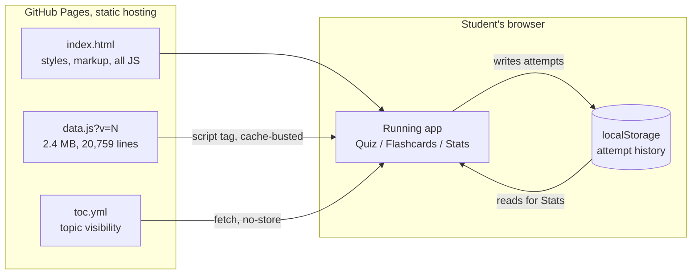
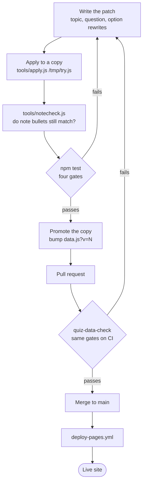

# Architecture

Two files serve the app. Four gates guard the content.

The runtime is deliberately boring: one HTML file, one data file, no backend and no
build step. Most of the engineering in this repo sits somewhere less obvious, in the
checks that stop a question from being answerable without reading it.

| | |
|---|---|
| Topics | 34 |
| Quiz questions | 1,245 (18 to 50 per topic) |
| Flashcards | 831 |
| Dependencies | none, `npm install` is not needed |
| Backend | none, nothing leaves the browser |

## What the browser loads

There is no build step, so the repository *is* the site. The browser fetches three
things and keeps every result on the device. There is no name or email prompt and no
score reporting: the **Stats** screen reads the same local storage that wrote it.

`data.js` is cached hard by URL, so **every content change must bump `?v=N`** in
`index.html`. Forgetting it is the most common reason an edit appears to do nothing.
`toc.yml` is fetched with `no-store` and needs no bump.

## Why the content needs gates

A multiple choice question can be factually perfect and still be broken, if the right
answer is visibly the odd one out. Correct answers tend to get written carefully while
distractors get written quickly, which leaves the answer longer, or bolder, or the only
one carrying a parenthetical aside. A student can then score well above chance without
knowing the material.

Each gate is one such shortcut, measured across all 1,245 questions. `npm test` fails if
any of them fires.

| Gate | The shortcut it blocks | Threshold |
|---|---|---|
| Length | Pick the longest option | correct option under 1.3x the average distractor |
| Position | Always pick the same letter | no index correct in 40% or more of a topic |
| Formatting | Pick the only bolded option | emphasis must not be unique to the answer, either direction |
| Trailing gloss | Pick the only one that explains itself | a trailing `(...)` must not be unique to the answer, either direction |

All four currently report 0 flagged.

The check also prints a number it does **not** fail on: how often "pick the single
longest option" would win. That figure went from **59.7%** to **32.7%** against a 25%
chance baseline. Zero flagged questions does not mean zero signal, which is why the
number is reported alongside the gates rather than replaced by them.

## Editing content, from a copy to the live site

Content edits run through a copy of `data.js` first. The risky part is not the option
text but its explanation: each `note` quotes fragments of its own distractors, so
rewriting an option can silently orphan the sentence that describes it.

Four habits make that pipeline work, and each exists because something went wrong
without it:

1. **Patch, do not hand-edit.** Rewrites are declared as data keyed by the existing
   option text, so an edit cannot quietly land on the wrong question.
2. **Guard the answer.** `apply.js` refuses to touch the correct option unless told to
   explicitly, so no edit can change which answer is right.
3. **Diff the orphan set, not the count.** Compare which note bullets are broken before
   and after. One newly broken bullet plus one coincidentally repaired elsewhere nets to
   zero on a total and hides the damage.
4. **Gate twice.** The same check runs locally and on CI, with an optional pre-commit
   hook as well, so a red `main` needs three misses.

**What the gates cannot do:** they compare lengths, indices and markup. Nothing here can
tell whether a rewritten option is still *true*, so edited questions still have to be
read. See "Writing good questions" in the [README](README.md) for the authoring rules.

## Why `data.js` is pretty-printed

It is stored at 20,759 lines rather than one. It used to be a single 2.2 MB line, and
because Git compares line by line, that made every edit "line 1 changed". Two branches
touching unrelated topics conflicted by definition, and a one word fix produced a 4.4 MB
diff. Measured on this repo:

| | one line | pretty-printed |
|---|---|---|
| Unrelated edits to different topics | conflict | merges cleanly |
| Diff to read for a one word fix | 4,447,188 bytes | 582 bytes |

Indenting costs about 2% once gzipped, which is what students actually download. Any
script that rewrites the file must reproduce that form, since a bare
`JSON.stringify(data)` collapses it straight back.
